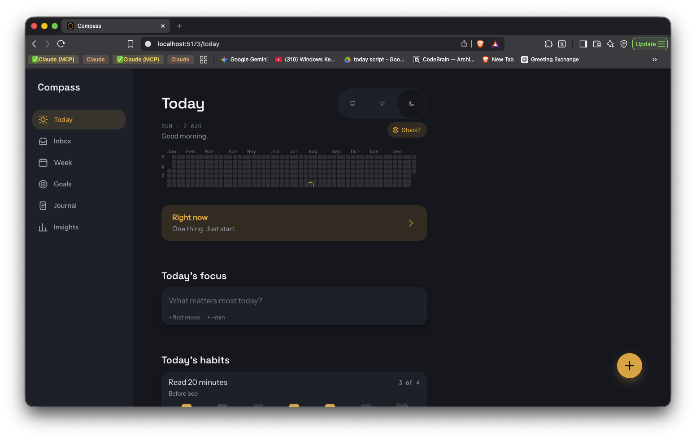
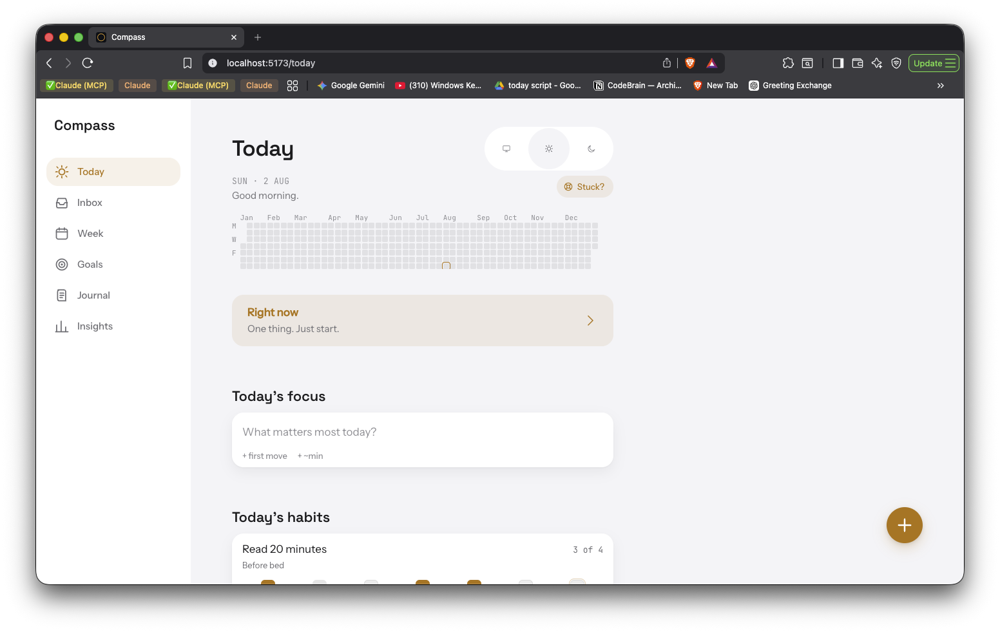

# Compass

A personal, local-first PWA that combines a habit tracker, daily planner,
journal, and goal cascade into one calm system.

## Why

Compass exists to connect daily actions to long-term goals for a brain that
gets distracted — the system is meant to carry the load, not willpower.
Flexible habits instead of punishing streaks, a hard cap on how much you can
pile onto one day, and a 2-minute evening review that closes the loop: the
goal is a tool that stays calm and useful even on the days you're not.

It's a single-user app, built for one person's laptop and phone, fully
functional offline.

## Screenshots

_Coming soon — drop images into [`docs/`](docs)._

| Today (dark)                                       | Today (light)                                        |
| -------------------------------------------------- | ---------------------------------------------------- |
|  |  |

## Features

What's actually built so far:

- **Today screen** — the daily home of the app:
  - **MITs ("Most Important Tasks")**, capped at 3 per day. No error
    messages when you hit the cap — the input just quietly becomes "Three
    is enough for today."
  - **Flexible habit tracking**: up to 5 active habits, each with an
    X-of-7-per-week target instead of an all-or-nothing streak. Missing a
    day doesn't reset anything — "skipped" is a neutral, non-judgmental
    state, not a broken streak.
  - **Year contribution grid**, GitHub-style: a quiet glance at completed
    daily reviews across the whole year, colored by that day's review
    score.
  - **Guided evening review**: a 4-step, ~2-minute daily check-in (how the
    day went, one win, one lesson, tomorrow's focus) that autosaves as you
    go and resumes if you close it partway through.
  - **"Right now" focus mode**: a full-screen view that shows exactly one
    task — its title and an optional tiny "first move" — with a 2 or
    25-minute timer to start it. No list, no decision fatigue.
  - **"I'm stuck" overlay**: an always-reachable, gentle escape hatch for
    frozen days. Shows one tiny next action (never the whole task list),
    warm non-judgmental copy, a 2-minute timer, or a 60-second breathing
    moment. No streaks, no stats, no pressure.
  - **Optional "first move" and time estimate on tasks**: an absurdly
    small physical starting action (e.g. "open the doc") and a rough
    `~min` estimate, both off by default behind a quiet "+" affordance —
    never required fields.
- **Inbox** — the frictionless capture-and-process screen:
  - A calm list of unprocessed captures, newest first, with a quiet
    unprocessed-count badge on the Inbox tab (hidden when empty).
  - **Four ways to turn a thought into something real**: a task (with
    date quick-chips, an MIT toggle, optional goal link), a habit, a
    journal note, or "someday" — parked in a collapsible section instead
    of cluttering the main list. Plus edit and (soft) delete.
  - **Keyboard-driven triage** on desktop: `j`/`k` to move through the
    list, `t`/`h`/`e` to jump straight into the task/habit/edit form for
    the selected item, `n`/`s`/Backspace to note/someday/delete it
    instantly — no dialog in the way.
  - A genuinely calm "Inbox zero. Nothing to sort." when there's nothing
    left to process.
- **Light and dark themes**, following the system setting by default.
- **Installable, offline-first PWA** — the app shell is precached, so it
  loads and works with no network connection.
- **Local-first storage** — all data lives in IndexedDB on-device; nothing
  leaves your browser today.

## Tech stack

- **React 18** + **TypeScript**, built with **Vite**
- **Tailwind CSS** for styling, driven entirely by design tokens
- **Dexie** (IndexedDB) for local-first storage, with `dexie-react-hooks`
  for reactive queries
- **Zustand** for UI-only state (theme preference, dialog open/closed)
- **React Router** for navigation
- **vite-plugin-pwa** (Workbox) for the installable, offline app shell
- **Vitest** + `fake-indexeddb` for testing the data layer

Cloud sync (Supabase) is planned but not yet built — today the app is
entirely local, single-device.

## Getting started

Requires **Node `^20.19.0` or `>=22.12.0`** (Vite 8's requirement).

```bash
npm install
```

```bash
npm run dev
```

```bash
npm run build
```

```bash
npm run test
```

## Project structure

```
src/
  db/            Dexie database, schema, and product-rule enforcement
    repo/        The ONLY files allowed to touch Dexie directly — one
                 module per domain (habits, tasks, goals, journal, ...)
  types/         Shared TypeScript interfaces — the data contract
  components/    Reusable UI (shell, nav, dialogs, icons, design-system
                 primitives) and today/ for Today-screen-specific pieces
  pages/         Route-level screens
  styles/        tokens.css — the only place raw colors/spacing/type live
  lib/           Small framework-agnostic helpers (dates, hooks)
```

Components never import Dexie directly — they call into `src/db/repo/*.ts`,
which is the only layer that touches the database.

## Roadmap

- [x] Project scaffold (Vite + React + TS + Tailwind + PWA)
- [x] Design system: theming (light/dark) and iOS-inspired polish
- [x] Local data layer (Dexie schema, repos, product-rule enforcement)
- [x] Today screen (MITs, habits, year grain, evening review)
- [x] Focus mode & "I'm stuck" support
- [x] Inbox (quick capture triage)
- [ ] Goals cascade (year → month → week)
- [ ] Week view
- [ ] Journal
- [ ] Insights
- [ ] PWA hardening
- [ ] Cloud sync (Supabase)

---

Personal project / portfolio piece — not affiliated with any company.
